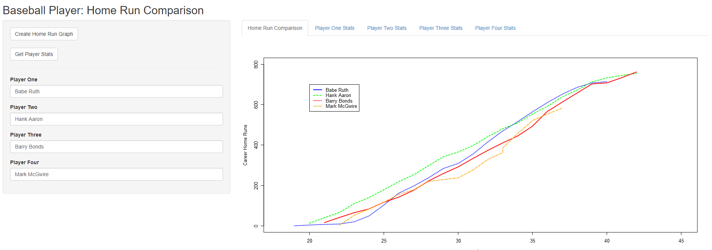
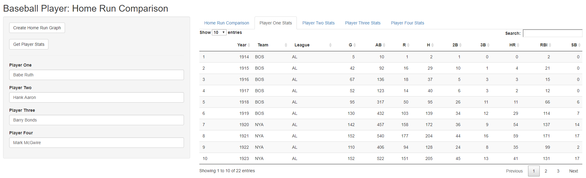

# Homerun Comparison

### Homerun App Description:

This application is designed to compare the homeruns of all baseball players since 1870 utilizing the [Sean Lahman](http://www.seanlahman.com/baseball-archive/statistics/) dataset. If you think the current baseball homerun kings are great, then go ahead and compare them to classics like Babe Ruth and Hank Aaron. See if they all are equal utilizing a simple line graph to look over the trajectory of their careers. 

### Homerun Graph

+ The homerun graph allows a user to visualize the homeruns of a player over the course of their career. The graph is a line graph and is color coded by player. Simply enter in the name of a player and click on the **Create Home Run Graph** button to create the graph. 

---

### Player Statistics

+ The app also returns the stats for each individual player and displays them in their own interactive table that the user can search. 

